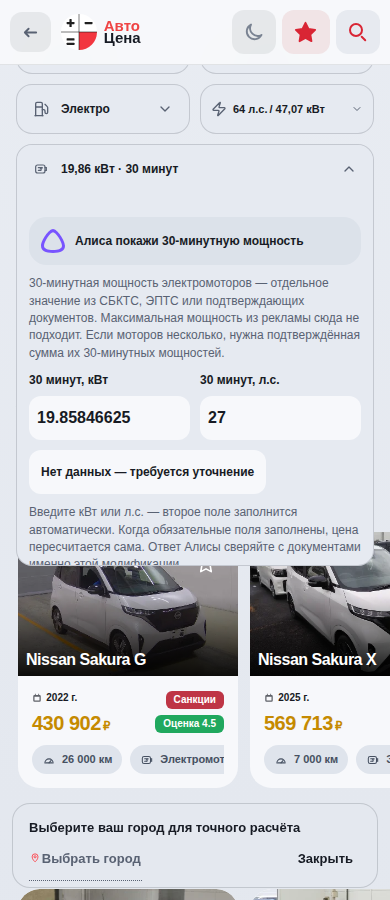

# 21.09.2026 — EV/гибриды, сохранение и порядок карточки

План до начала реализации записан в roadmap.md. Исходный main: 70d04949b58ace9c616560903fca35472694418c. PR: https://github.com/jeep-jim/AvtoCena/pull/1102.

## Реализовано

- Единый жёлтый цвет цен EV/гибридов: цена продавца, аукцион, предварительный/полный и сохранённый расчёт, избранное и превью заявки при наличии признака топлива. Стрелки курсов сохраняют собственный смысл роста/падения.
- Для EV отдельный запрос Алисе без запроса классификации гибрида; нет вывода 30-минутной мощности из пиковой. «Нет данных — требуется уточнение» очищает обе единицы и блокирует полный расчёт через существующую валидацию. Число в свёрнутой плитке показывается компактно; точность исходного ввода для расчёта не меняется.
- Дата и автор сохранения только CRM-ролям. Гостям эти поля не передаются сервером. Для прежних записей имя определяется из savedBy; новые сохраняют имя сотрудника из проверенной сессии.
- Сохранить можно после явного изменения. Автоподстановка города не является правкой сотрудника. Диалог Да/Нет: отмена сохраняет черновик, подтверждение записывает расчёт; после успеха кнопка исчезает. Серверная проверка ролей и конфликты версий сохранены.
- «Санкции» вместо длинных бейджей; в карточке бейдж перенесён из блока продажи в начало обычного текста предупреждения без висячего левого отступа.
- Серые разделители характеристик; более заметные статичные плитки; белый японский блок продажи в светлой теме; город 16 px без изменения минимальной высоты кнопки.
- Порядок в DOM для всех рынков: цена → предупреждение → доставка → структура цены → редакторы → статичные характеристики → Алиса → действия. Перенесена как исходная, так и пересчитанная структура цены.

## Проверки

Локальная сборка и TypeScript прошли. Полный локальный набор: 1522 теста, один старый тест искал встроенный список топлива, вынесенный в общую функцию. Проверка заменена вызовами общей функции по бензину/дизелю/EV/гибридам; повтор 20 тематических тестов прошёл. Финальный CI прошёл: 1522/1522, TypeScript и сборка. Run https://github.com/jeep-jim/AvtoCena/actions/runs/35551571288. Браузерный стенд: 48 сценариев / 228 открытий плюс новые проверки сохранения/EV — success, https://github.com/jeep-jim/AvtoCena/actions/runs/35551569952.

Браузерные сценарии дополнены проверкой Да/Нет (отмена не отправляет запрос), гостевой видимости, имени нового автора, автогорода, жёлтой цены EV в обеих темах, отдельной ссылки Алисы и очистки 30-минутной мощности. Реальные сохранённые расчёты и заявки при проверках не изменять.

PR #1102 объединён, релиз af9892a06a7c759b678dcfe7427bf23df20d34c1. Развёртывание 35551847079 завершилось success. На реальной Sakura проверены обе темы, жёлтая цена, порядок блоков, город 16 px, белая плашка продажи и отсутствие информации сохранения у гостя.

Первый live-прогон 35551847056 выявил геометрию до готовности потоковых CSS (высота summary 20 вместо 48 px) и React 418/422. Ошибка screenshot маскировала исходное исключение; исходная геометрия сохранена в failure.json. Дополнительный PR #1103 убирает внешний appendChild финансового блока до гидратации: контейнер теперь часть React-дерева карточки. Тест ожидает готовые стили, сохраняет исходную ошибку и включает реальную Sakura с проверкой отсутствия ошибок hydration. PR #1103 прошёл CI 35552512473 и браузерный стенд 35552510236 (48 сценариев / 228 открытий), объединён: 9e5003951077831a04082381e4ee001265dd8bac. Финальное развёртывание [35552792095](https://github.com/jeep-jim/AvtoCena/actions/runs/35552792095) — success. Финальный браузерный прогон [35552792248](https://github.com/jeep-jim/AvtoCena/actions/runs/35552792248), попытка 2 — success: стенд 48 сценариев / 228 открытий; реальный сайт 36 сценариев / 168 открытий (бензин, гибрид, сохранённая Sakura; обе темы; 320/360/390/414/768/1280 px). Live-проверка требует отсутствия ошибок страницы. Первая попытка остановилась на нестабильном ожидании прокрутки 100 мс в стенде; повтор того же релиза прошёл полностью.

Ручная проверка опубликованной 9e500395 на Sakura: ошибок приложения React 418/422 больше нет; в логе только сообщение расширения облачного браузера. Финансовые сервисы раскрываются вместе со структурой цены. Цена светлой темы rgb(197,138,0), тёмной rgb(255,210,31), город 16 px. Сохранённый расчёт при проверках не изменялся.

## Завершено

Все перечисленные изменения опубликованы. План до работы и итог после работы отражены в roadmap.md. Полный CI финального исправления: 1522/1522, TypeScript и production build — success. Финальный отчёт и скриншоты: artifact 10619860172.

